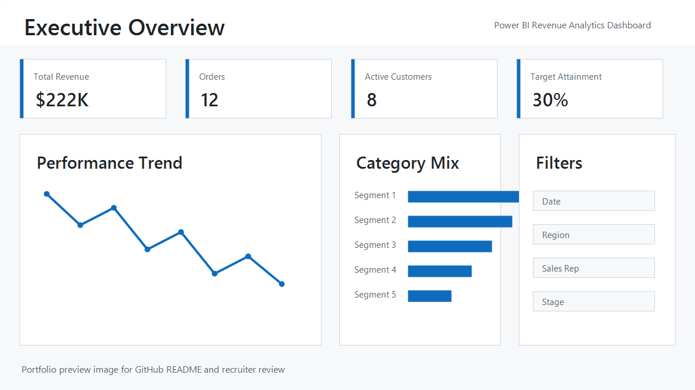
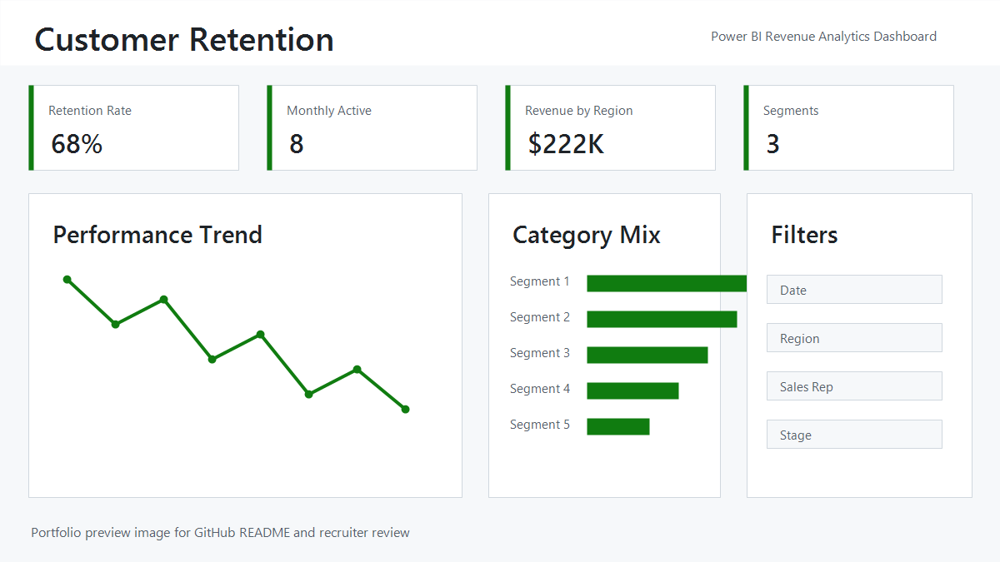
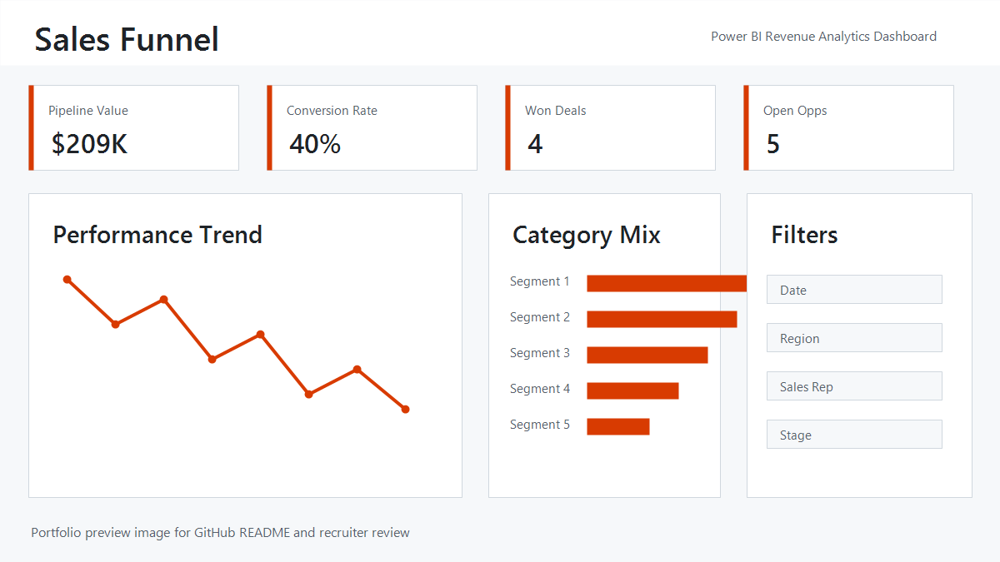
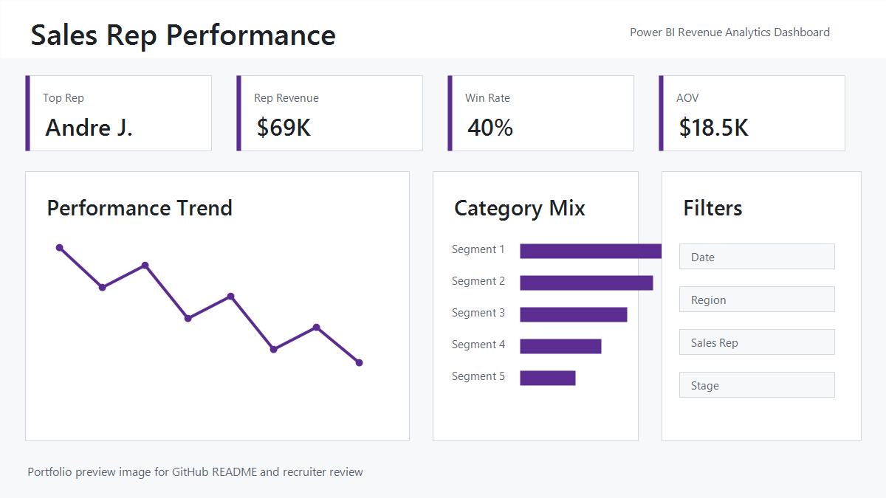

# Revenue Performance Dashboard

Professional Power BI revenue analytics project built to show executive reporting, sales funnel analysis, customer retention, and sales representative performance. The project is structured as both a PBIX deliverable and an editable PBIP source project, making it easier to review the report, inspect the semantic model, and evaluate the DAX/report-building work.

## Project Contents

- `Power BI Project.pbip` - publish-ready editable Power BI Project file.
- `Revenue Performance Dashboard.pbix` - packaged dashboard copy.
- `Power BI Project.Report/` - report page and visual definitions.
- `Power BI Project.SemanticModel/` - semantic model, relationships, tables, and DAX measures.
- `SQL/` - PostgreSQL setup scripts for tables, sample data, and reporting views.
- `screenshots/` - dashboard page previews for GitHub and recruiter review.
- `PROJECT_SKILLS.md` - portfolio summary for recruiters and hiring managers.

## Dashboard Preview

## Dashboard Pages

- Executive Overview
- Customer Retention
- Sales Funnel
- Sales Rep Performance

## Features

- Revenue, orders, active customers, conversion, and average order value KPIs
- Customer retention and monthly active customer analysis
- Opportunity funnel and pipeline tracking
- Advanced DAX measures for MTD, QTD, YTD, MoM, QoQ, and YoY trends
- Sales representative ranking, contribution share, and performance scoring
- Recruiter-friendly PBIP source structure with report and semantic model files
- PostgreSQL schema, seed data, and views included for reproducible setup

## Skills Demonstrated

- Power BI report design and page layout
- DAX KPI development and time intelligence
- Semantic model relationships and measure organization
- PostgreSQL table/view design for analytics reporting
- Sales analytics, retention analysis, and pipeline reporting
- GitHub-ready project packaging and documentation

## How To Review

1. Open `Power BI Project.pbip` in Power BI Desktop for the publish-ready report project.
2. Review the four report pages and the `Revenue_measures` table.
3. Publish from the PBIP in Power BI Desktop, or use `Revenue Performance Dashboard.pbix` as the packaged dashboard copy.
4. Read `PROJECT_SKILLS.md` for a concise portfolio explanation.

## PostgreSQL Setup

Run the SQL scripts in order if you want to recreate the source database:

1. `SQL/01_create_tables.sql`
2. `SQL/02_insert_sample_data.sql`
3. `SQL/03_create_views.sql`

## Tools

- Power BI Desktop
- DAX
- PostgreSQL
- Power BI JSON themes
- Git/GitHub
